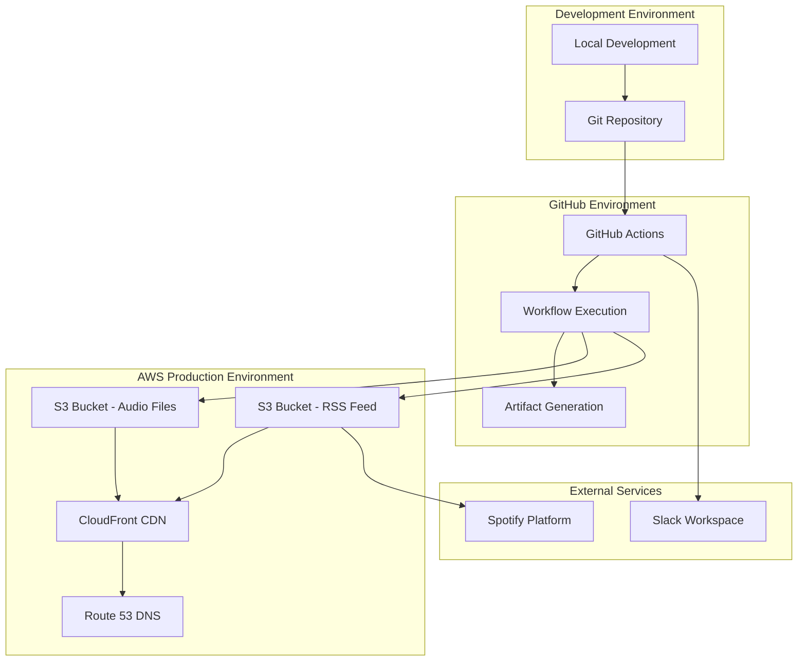
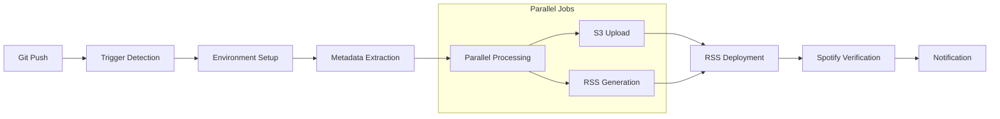

# デプロイメント設計書

## 概要

Spotify ポッドキャスト自動化システムのデプロイメント戦略、インフラ要件、CI/CD パイプライン設計を定義します。

## デプロイメントアーキテクチャ

### 1. 全体構成



### 2. インフラ構成要素

#### AWS リソース
- **S3 Bucket（プライマリ）**: 音声ファイルとRSSフィード保存
- **S3 Bucket（バックアップ）**: 災害復旧用レプリケーション
- **CloudFront Distribution**: グローバルCDN配信
- **Route 53 Hosted Zone**: カスタムドメイン管理
- **IAM Role**: GitHub Actions用の最小権限アクセス

#### 外部サービス
- **GitHub Actions**: CI/CDパイプライン実行環境
- **Spotify for Podcasters**: ポッドキャスト配信プラットフォーム
- **Slack**: 運用通知とアラート

## CI/CD パイプライン設計

### 1. パイプライン概要



### 2. ワークフロー詳細設計

#### GitHub Actions Workflow
```yaml
name: Podcast Release Automation

on:
  push:
    branches: [main]
    paths: ['episodes/**/*.mp3']
  workflow_dispatch:
    inputs:
      episode_path:
        description: 'MP3ファイルのパス'
        required: true
        type: string

concurrency:
  group: podcast-release
  cancel-in-progress: false

jobs:
  setup:
    runs-on: ubuntu-latest
    timeout-minutes: 2
    outputs:
      episode-slug: ${{ steps.extract.outputs.slug }}
      episode-metadata: ${{ steps.extract.outputs.metadata }}
      commit-sha: ${{ steps.extract.outputs.sha }}
      
    steps:
      - name: Checkout repository
        uses: actions/checkout@v4
        with:
          fetch-depth: 0
          
      - name: Setup Python
        uses: actions/setup-python@v4
        with:
          python-version: '3.11'
          cache: 'pip'
          
      - name: Install dependencies
        run: |
          pip install -r requirements.txt
          
      - name: Extract episode metadata
        id: extract
        run: |
          python scripts/extract_metadata.py
          
  upload:
    needs: setup
    runs-on: ubuntu-latest
    timeout-minutes: 1
    
    steps:
      - name: Configure AWS credentials
        uses: aws-actions/configure-aws-credentials@v4
        with:
          role-to-assume: ${{ secrets.AWS_ROLE_ARN }}
          aws-region: ${{ secrets.AWS_REGION }}
          
      - name: Upload to S3 with retry
        run: |
          python scripts/upload_s3.py \
            --episode-slug "${{ needs.setup.outputs.episode-slug }}" \
            --metadata '${{ needs.setup.outputs.episode-metadata }}'
            
  rss-deploy:
    needs: [setup, upload]
    runs-on: ubuntu-latest
    timeout-minutes: 1
    
    steps:
      - name: Generate and deploy RSS
        run: |
          python scripts/build_rss.py \
            --episode-slug "${{ needs.setup.outputs.episode-slug }}" \
            --commit-sha "${{ needs.setup.outputs.commit-sha }}"
            
  verify:
    needs: [setup, rss-deploy]
    runs-on: ubuntu-latest
    timeout-minutes: 10
    
    steps:
      - name: Verify Spotify indexing
        id: verify
        run: |
          python scripts/check_spotify.py \
            --episode-guid "repo-${{ needs.setup.outputs.commit-sha }}-${{ needs.setup.outputs.episode-slug }}"
            
      - name: Generate summary
        run: |
          python scripts/generate_summary.py \
            --verification-result '${{ steps.verify.outputs.result }}'
            
  notify:
    needs: [setup, verify]
    runs-on: ubuntu-latest
    if: always()
    
    steps:
      - name: Send notification
        run: |
          python scripts/send_notification.py \
            --episode-slug "${{ needs.setup.outputs.episode-slug }}" \
            --status "${{ needs.verify.result }}" \
            --workflow-url "${{ github.server_url }}/${{ github.repository }}/actions/runs/${{ github.run_id }}"
```

### 3. 環境別設定

#### 開発環境
```yaml
# .github/environments/development.yml
name: development
variables:
  AWS_S3_BUCKET: podcast-dev-bucket
  BASE_URL: https://dev-cdn.yourpodcast.com
  SPOTIFY_SHOW_ID: dev_show_id
  MAX_RETRY_ATTEMPTS: "1"
  SPOTIFY_MAX_ATTEMPTS: "3"
```

#### 本番環境
```yaml
# .github/environments/production.yml
name: production
protection_rules:
  - type: required_reviewers
    required_reviewers: 2
  - type: wait_timer
    wait_timer: 5
    
variables:
  AWS_S3_BUCKET: podcast-prod-bucket
  BASE_URL: https://cdn.yourpodcast.com
  SPOTIFY_SHOW_ID: prod_show_id
  MAX_RETRY_ATTEMPTS: "3"
  SPOTIFY_MAX_ATTEMPTS: "10"
```

## インフラストラクチャ設計

### 1. AWS リソース定義

#### S3 バケット設定
```json
{
  "Version": "2012-10-17",
  "Statement": [
    {
      "Sid": "PublicReadGetObject",
      "Effect": "Allow",
      "Principal": "*",
      "Action": "s3:GetObject",
      "Resource": "arn:aws:s3:::podcast-prod-bucket/*"
    }
  ]
}
```

#### CloudFront Distribution
```yaml
# cloudfront-config.yml
Distribution:
  DistributionConfig:
    Comment: "Podcast CDN Distribution"
    DefaultCacheBehavior:
      TargetOriginId: S3-podcast-prod-bucket
      ViewerProtocolPolicy: redirect-to-https
      CachePolicyId: 658327ea-f89d-4fab-a63d-7e88639e58f6  # Managed-CachingOptimized
      Compress: true
      
    Origins:
      - Id: S3-podcast-prod-bucket
        DomainName: podcast-prod-bucket.s3.amazonaws.com
        S3OriginConfig:
          OriginAccessIdentity: ""
          
    CacheBehaviors:
      - PathPattern: "*.mp3"
        TargetOriginId: S3-podcast-prod-bucket
        ViewerProtocolPolicy: redirect-to-https
        CachePolicyId: 4135ea2d-6df8-44a3-9df3-4b5a84be39ad  # CachingDisabled
        TTL:
          DefaultTTL: 86400
          MaxTTL: 31536000
          
      - PathPattern: "rss.xml"
        TargetOriginId: S3-podcast-prod-bucket
        ViewerProtocolPolicy: redirect-to-https
        CachePolicyId: 4135ea2d-6df8-44a3-9df3-4b5a84be39ad  # CachingDisabled
        TTL:
          DefaultTTL: 300
          MaxTTL: 300
```

#### IAM Role設定
```json
{
  "Version": "2012-10-17",
  "Statement": [
    {
      "Effect": "Allow",
      "Action": [
        "s3:GetObject",
        "s3:PutObject",
        "s3:DeleteObject",
        "s3:ListBucket"
      ],
      "Resource": [
        "arn:aws:s3:::podcast-prod-bucket",
        "arn:aws:s3:::podcast-prod-bucket/*"
      ]
    },
    {
      "Effect": "Allow", 
      "Action": [
        "cloudfront:CreateInvalidation"
      ],
      "Resource": "arn:aws:cloudfront::*:distribution/*"
    }
  ]
}
```

### 2. セキュリティ設定

#### GitHub Actions OIDC設定
```json
{
  "Version": "2012-10-17",
  "Statement": [
    {
      "Effect": "Allow",
      "Principal": {
        "Federated": "arn:aws:iam::ACCOUNT_ID:oidc-provider/token.actions.githubusercontent.com"
      },
      "Action": "sts:AssumeRoleWithWebIdentity",
      "Condition": {
        "StringEquals": {
          "token.actions.githubusercontent.com:aud": "sts.amazonaws.com"
        },
        "StringLike": {
          "token.actions.githubusercontent.com:sub": "repo:USERNAME/REPO:*"
        }
      }
    }
  ]
}
```

#### Secrets管理
```yaml
# GitHub Repository Secrets
AWS_ROLE_ARN: arn:aws:iam::123456789012:role/GitHubActionsRole
AWS_REGION: us-east-1
SPOTIFY_CLIENT_ID: your_spotify_client_id
SPOTIFY_CLIENT_SECRET: your_spotify_client_secret
SPOTIFY_REFRESH_TOKEN: your_spotify_refresh_token
SPOTIFY_SHOW_ID: your_spotify_show_id
SLACK_WEBHOOK_URL: https://hooks.slack.com/services/...
```

## 監視とアラート

### 1. GitHub Actions監視

#### ワークフロー成功率
```yaml
# .github/workflows/monitoring.yml
name: Monitoring Dashboard

on:
  schedule:
    - cron: '0 */6 * * *'  # 6時間ごと
    
jobs:
  metrics:
    runs-on: ubuntu-latest
    steps:
      - name: Collect workflow metrics
        run: |
          gh api repos/${{ github.repository }}/actions/runs \
            --paginate \
            --jq '.workflow_runs[] | select(.name == "Podcast Release Automation") | {id, status, conclusion, created_at, updated_at}' \
            > workflow_metrics.json
            
      - name: Generate report
        run: |
          python scripts/generate_metrics_report.py
```

### 2. アラート設定

#### Slack通知設定
```python
# scripts/monitoring/alerts.py
class AlertManager:
    def __init__(self, webhook_url: str):
        self.webhook_url = webhook_url
        
    def send_critical_alert(self, message: str):
        payload = {
            "text": f"🚨 CRITICAL: {message}",
            "channel": "#podcast-alerts",
            "username": "Podcast Bot",
            "attachments": [{
                "color": "danger",
                "fields": [{
                    "title": "Severity",
                    "value": "Critical",
                    "short": True
                }]
            }]
        }
        requests.post(self.webhook_url, json=payload)
        
    def send_warning_alert(self, message: str):
        payload = {
            "text": f"⚠️ WARNING: {message}",
            "channel": "#podcast-alerts", 
            "username": "Podcast Bot"
        }
        requests.post(self.webhook_url, json=payload)
```

## 災害復旧

### 1. バックアップ戦略

#### S3 レプリケーション
```json
{
  "Role": "arn:aws:iam::123456789012:role/replication-role",
  "Rules": [
    {
      "ID": "ReplicateToBackup",
      "Status": "Enabled",
      "Priority": 1,
      "Filter": {
        "Prefix": "podcast/"
      },
      "Destination": {
        "Bucket": "arn:aws:s3:::podcast-backup-bucket",
        "StorageClass": "STANDARD_IA"
      }
    }
  ]
}
```

#### GitHub Actions履歴保存
```yaml
# .github/workflows/backup.yml
name: Backup Workflow History

on:
  schedule:
    - cron: '0 2 * * 0'  # 毎週日曜日2時
    
jobs:
  backup:
    runs-on: ubuntu-latest
    steps:
      - name: Export workflow history
        run: |
          gh api repos/${{ github.repository }}/actions/runs \
            --paginate > backup/workflow_history_$(date +%Y%m%d).json
            
      - name: Upload to backup S3
        run: |
          aws s3 cp backup/ s3://podcast-backup-bucket/github-actions/ --recursive
```

### 2. 復旧手順

#### RSSフィード復旧
```bash
#!/bin/bash
# scripts/disaster_recovery/restore_rss.sh

# 1. バックアップからRSSフィードを復元
aws s3 cp s3://podcast-backup-bucket/rss.xml s3://podcast-prod-bucket/rss.xml

# 2. CloudFrontキャッシュを無効化
aws cloudfront create-invalidation \
  --distribution-id $CLOUDFRONT_DISTRIBUTION_ID \
  --paths "/rss.xml"

# 3. Spotify再インデックス要求
curl -X POST "https://podcasters.spotify.com/api/v1/shows/$SPOTIFY_SHOW_ID/reindex" \
  -H "Authorization: Bearer $SPOTIFY_ACCESS_TOKEN"
```

#### 完全システム復旧
```bash
#!/bin/bash
# scripts/disaster_recovery/full_restore.sh

echo "Starting full system restore..."

# 1. S3バケット復元
aws s3 sync s3://podcast-backup-bucket/ s3://podcast-prod-bucket/

# 2. CloudFront設定復元
aws cloudfront get-distribution-config \
  --id $BACKUP_DISTRIBUTION_ID > distribution-config.json

# 3. DNS設定確認
aws route53 list-resource-record-sets \
  --hosted-zone-id $HOSTED_ZONE_ID

echo "Full restore completed. Please verify functionality."
```

## パフォーマンス最適化

### 1. ワークフロー最適化

#### 並列実行
- メタデータ抽出と依存関係のないタスクの並列化
- S3アップロードとRSS生成の並列実行
- キャッシュ活用による実行時間短縮

#### リソース効率化
```yaml
jobs:
  optimize:
    runs-on: ubuntu-latest
    strategy:
      matrix:
        include:
          - task: upload
            timeout: 1
          - task: rss-generation
            timeout: 1
          - task: verification
            timeout: 8
```

### 2. CDN最適化

#### キャッシュ戦略
- **MP3ファイル**: 1年間キャッシュ（不変コンテンツ）
- **RSSフィード**: 5分間キャッシュ（頻繁更新）
- **圧縮**: Gzip圧縮有効化

#### 地理的分散
- **エッジロケーション**: 世界中のCloudFrontエッジを活用
- **オリジンシールド**: 東京リージョンでオリジンシールド有効化

## 運用手順

### 1. デプロイ手順

#### 通常デプロイ
1. MP3ファイルを`episodes/`ディレクトリに配置
2. ファイル名を`YYYYMMDD-title-kebab.mp3`形式に変更
3. mainブランチにコミット・プッシュ
4. GitHub Actionsの実行を確認
5. Slack通知で結果を確認

#### 緊急デプロイ
1. `workflow_dispatch`で手動トリガー
2. 特定のMP3ファイルパスを指定
3. 優先度高でワークフロー実行

### 2. 運用監視

#### 日次チェック項目
- [ ] 過去24時間のワークフロー実行状況
- [ ] S3バケットのストレージ使用量
- [ ] CloudFront転送量とエラー率
- [ ] Spotify API使用量とレート制限状況

#### 週次チェック項目
- [ ] GitHub Actions使用時間の確認
- [ ] AWS費用の確認
- [ ] バックアップ状況の確認
- [ ] セキュリティアップデートの確認

### 3. トラブルシューティング

#### よくある問題と対処法

**問題**: ワークフローが2分でタイムアウト
**対処**: 
- ファイルサイズを確認（50MB以下推奨）
- 並列実行設定を確認
- S3リージョンを確認

**問題**: Spotify反映が15分以上かかる
**対処**:
- RSSフィードの妥当性を確認
- Spotify for Podcastersの設定を確認
- 手動でSpotify再インデックスを実行

**問題**: S3アップロードが失敗
**対処**:
- IAM権限を確認
- バケットの存在を確認
- リトライ回数を増加