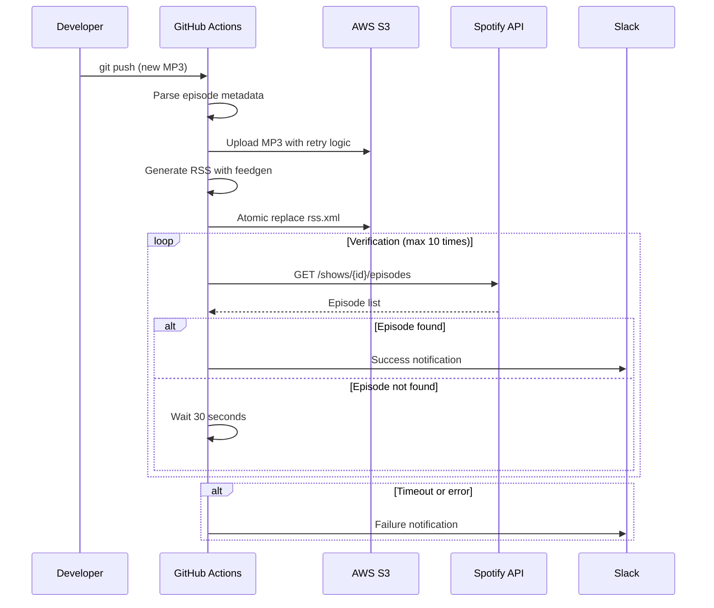

# システムアーキテクチャ設計書

## 概要

Spotify ポッドキャスト自動化システムは、MP3ファイルのアップロードからSpotifyでの配信確認まで、完全自動化されたCI/CDパイプラインです。

## アーキテクチャ図

```mermaid
graph TB
    subgraph "GitHub Repository"
        A[episodes/*.mp3] --> B[GitHub Actions Trigger]
        B --> C[Workflow Execution]
    end
    
    subgraph "GitHub Actions Workflow"
        C --> D[Upload to S3]
        D --> E[Generate RSS Feed]
        E --> F[Deploy RSS to S3]
        F --> G[Verify Spotify Index]
        G --> H[Send Notifications]
    end
    
    subgraph "AWS S3"
        I[podcast/{YYYY}/{slug}.mp3]
        J[rss.xml]
        D --> I
        F --> J
    end
    
    subgraph "External Services"
        K[Spotify Web API]
        L[Slack Webhook]
        G --> K
        H --> L
    end
    
    subgraph "Podcast Listeners"
        M[Spotify App]
        N[Other RSS Readers]
        J --> M
        J --> N
    end
```

## システム構成要素

### 1. GitHub Actions Workflow
- **役割**: メインの自動化エンジン
- **トリガー**: `main`ブランチへのMP3ファイルのプッシュ、または手動実行
- **実行時間制約**: 2分以内
- **並列実行**: 可能な限り並列化してパフォーマンス向上

### 2. AWS S3 ストレージ
- **構成**:
  - `podcast/{YYYY}/{slug}.mp3`: 音声ファイル
  - `rss.xml`: RSS フィード
- **アクセス権限**: パブリック読み取り（Spotify要件）
- **キャッシュ制御**: `Cache-Control: public, max-age=300`

### 3. RSS生成システム
- **ライブラリ**: Python `feedgen`
- **更新方式**: アトミック置換（`rss.xml.new` → `rss.xml`）
- **全エピソード**: 過去分も含めて全て生成

### 4. Spotify検証システム
- **API**: Spotify Web API `/shows/{show_id}/episodes`
- **ポーリング**: 30秒間隔、最大10回
- **認証**: OAuth Refresh Token

## データフロー



## 非機能要件

### パフォーマンス
- **総実行時間**: ≤ 2分（GitHub Actions制約）
- **並列実行**: S3アップロードとメタデータ処理を並列化
- **リトライ戦略**: 最大3回、指数バックオフ

### 信頼性
- **冪等性**: 同一GUIDでの再実行を安全に処理
- **エラーハンドリング**: 各ステップでの適切な例外処理
- **ロールバック**: RSS更新失敗時の自動ロールバック

### セキュリティ
- **認証情報管理**: GitHub Secretsでの機密情報保護
- **最小権限原則**: 必要最小限のAWS/Spotify権限
- **監査ログ**: 全ての操作をGitHub Actions logに記録

### 可観測性
- **ログ**: 構造化ログ（JSON形式）
- **メトリクス**: 実行時間、成功/失敗率
- **通知**: Slack統合による運用チームへの通知

## 拡張性考慮事項

### 水平スケーリング
- **並列エピソード処理**: 複数MP3ファイルの同時処理
- **CDN統合**: CloudFront等での配信最適化

### 他プラットフォーム対応
- **Apple Podcasts**: 同一RSSフィードで対応可能
- **Google Podcasts**: 追加のサイトマップ生成

### ストレージ抽象化
- **インターフェース**: ストレージ操作の抽象化
- **プロバイダー切り替え**: S3以外（Cloudflare R2等）への対応

## セキュリティ考慮事項

### データ保護
- **転送中暗号化**: HTTPS/TLS 1.2以上
- **保存時暗号化**: S3のサーバーサイド暗号化
- **アクセス制御**: IAMロールベースのアクセス制御

### 認証・認可
- **GitHub Actions**: OIDC統合による一時認証情報
- **AWS**: IAMロールでの最小権限アクセス
- **Spotify**: OAuth 2.0 Refresh Token

### 監査・コンプライアンス
- **アクセスログ**: 全API呼び出しの記録
- **変更追跡**: Gitによる設定変更の追跡
- **インシデント対応**: エラー通知とエスカレーション手順