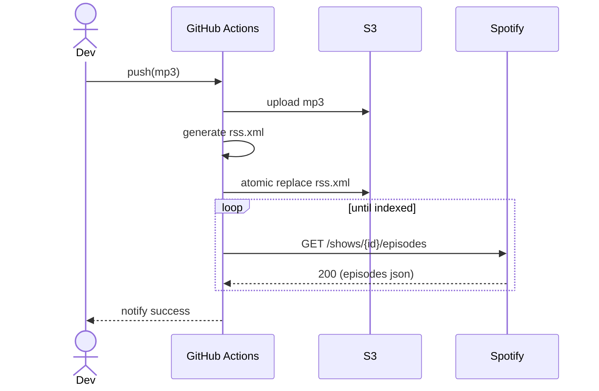

## 🎯 要求定義（Stakeholder Requirements）

| 項目             | 内容                                                                                                    |
| -------------- | ----------------------------------------------------------------------------------------------------- |
| **背景**         | Spotify へ自動でエピソードを配信したいが、公開アップロード API が無いため RSS フィード経由での自動化が必要。手作業を排除し、公開〜インデックス反映までを CI/CD で一気通貫にする。 |
| **目的**         | 1 クリック（もしくは PR マージ）で「音声ファイル→公開→Spotify 反映確認」まで完了するワークフローを GitHub Actions で提供し、人的オペレーションをゼロにする。        |
| **ステークホルダー**   | 番組プロデューサー／編集者、インフラ担当、開発者、リスナー                                                                         |
| **成功指標 (KPI)** | - すべての新規エピソードで **手動作業 0**<br>- MP3 コミットから **15 分以内に Spotify で再生可能**（平均）                               |
| **スコープ**       | *対象*：音声マスター（MP3/WAV）→ S3／CloudFront 配置、RSS 生成・デプロイ、Spotify 反映確認<br>*除外*：音声編集、動画ポッドキャスト、広告インサート        |
| **制約**         | - GitHub Actions Free/Tier で実行時間 ≤ 2 分/episode<br>- S3 署名付き URL 不可（Spotify から直アクセスできる公開 URL 必須）       |

---

## 🛠️ 要件定義（System Requirements）

### 1. 機能要件

| 番号  | 要件               | 説明・備考                                                                                                                                                                  |
| --- | ---------------- | ---------------------------------------------------------------------------------------------------------------------------------------------------------------------- |
| F-1 | **トリガー**         | `main` ブランチへの MP3 追加／更新、または `workflow_dispatch` で手動実行を開始できること                                                                                                          |
| F-2 | **音声アップロード**     | GitHub リポ内の `episodes/**/*.mp3` を AWS S3 の `podcast/{YYYY}/{slug}.mp3` へ `aws s3 cp` で転送すること                                                                           |
| F-3 | **RSS 生成**       | `feedgen`（Python）で `rss.xml` を再構築し、**全エピソード分**の `<item>` と `<lastBuildDate>` を含めること                                                                                    |
| F-4 | **RSS 配置**       | アトミックな置き換え（`rss.xml.new` → rename）で S3 の `rss.xml` を更新すること                                                                                                             |
| F-5 | **キャッシュ制御**      | RSS と MP3 の `Cache-Control` を `public, max-age=300` に設定すること                                                                                                            |
| F-6 | **Spotify 反映確認** | GitHub Actions のジョブ内で `GET https://api.spotify.com/v1/shows/{show_id}/episodes?limit=1` をポーリングし、新エピソード GUID が返るまで **最大 10 回・30 秒間隔** で再試行し、結果を workflow run の出力に記録すること |
| F-7 | **通知**           | 成功／失敗は GitHub Checks + Slack (Incoming Webhook) へ送信すること                                                                                                                |
| F-8 | **再実行**          | 同一 GUID のエピソードでリランしても RSS が不整合にならない（idempotent）こと                                                                                                                      |

### 2. 非機能要件

| 区分          | 要件                                                                                                                                            |
| ----------- | --------------------------------------------------------------------------------------------------------------------------------------------- |
| **セキュリティ**  | - AWS 認証情報は GitHub Secrets (`AWS_ACCESS_KEY_ID`, `AWS_SECRET_ACCESS_KEY`) で管理<br>- Spotify OAuth トークンは最短 TTL の Refresh Token を使用し、Secrets に保存 |
| **パフォーマンス** | Workflow 実行総時間 ≤ 2 分（反映確認は別ジョブでタイムアウト可）                                                                                                       |
| **信頼性**     | - RSS 生成スクリプトはテスト (`pytest`) を CI で実行<br>- アップロード失敗時は自動リトライ（max 3）                                                                            |
| **可観測性**    | GitHub Actions Summary にアップロード URL と Spotify エピソード ID を表示                                                                                     |
| **保守性**     | ステップは reusable workflow として切り出し、複数リポで共通利用可能にする                                                                                                |
| **ポータビリティ** | S3 以外の CDN（Cloudflare R2 など）に移行できるよう、ストレージ操作はラッパースクリプト経由に抽象化する                                                                                |

### 3. データ定義

| 項目         | 形式                        | 例                                          |
| ---------- | ------------------------- | ------------------------------------------ |
| エピソード slug | `YYYYMMDD-title-kebab`    | `20250618-automation-pipeline`             |
| GUID       | `repo-sha-{slug}` または手動指定 | `repo-abc123-20250618-automation-pipeline` |
| RSS 保存先    | `s3://{bucket}/rss.xml`   | `s3://podcast-cdn/rss.xml`                 |

### 4. ワークフローシーケンス（Mermaid）



### 5. 受け入れテスト（抜粋）

| 番号   | シナリオ         | 期待結果                     |
| ---- | ------------ | ------------------------ |
| AT-1 | 新規 MP3 をコミット | 15 分以内に Spotify アプリで再生可能 |
| AT-2 | GUID 重複コミット  | ワークフローは成功せずエラーで終了        |
| AT-3 | S3 通信障害      | 自動リトライ 3 回後に失敗通知         |

---

### 付録 — ディレクトリ構成（参考）

```
.
├── .github/
│   └── workflows/
│       └── release.yml     # GitHub Actions 定義
├── scripts/
│   ├── build_rss.py        # feedgen で RSS 再構築
│   └── check_spotify.py    # 反映確認スクリプト
└── episodes/
    └── 20250618-automation-pipeline.mp3
```

---
