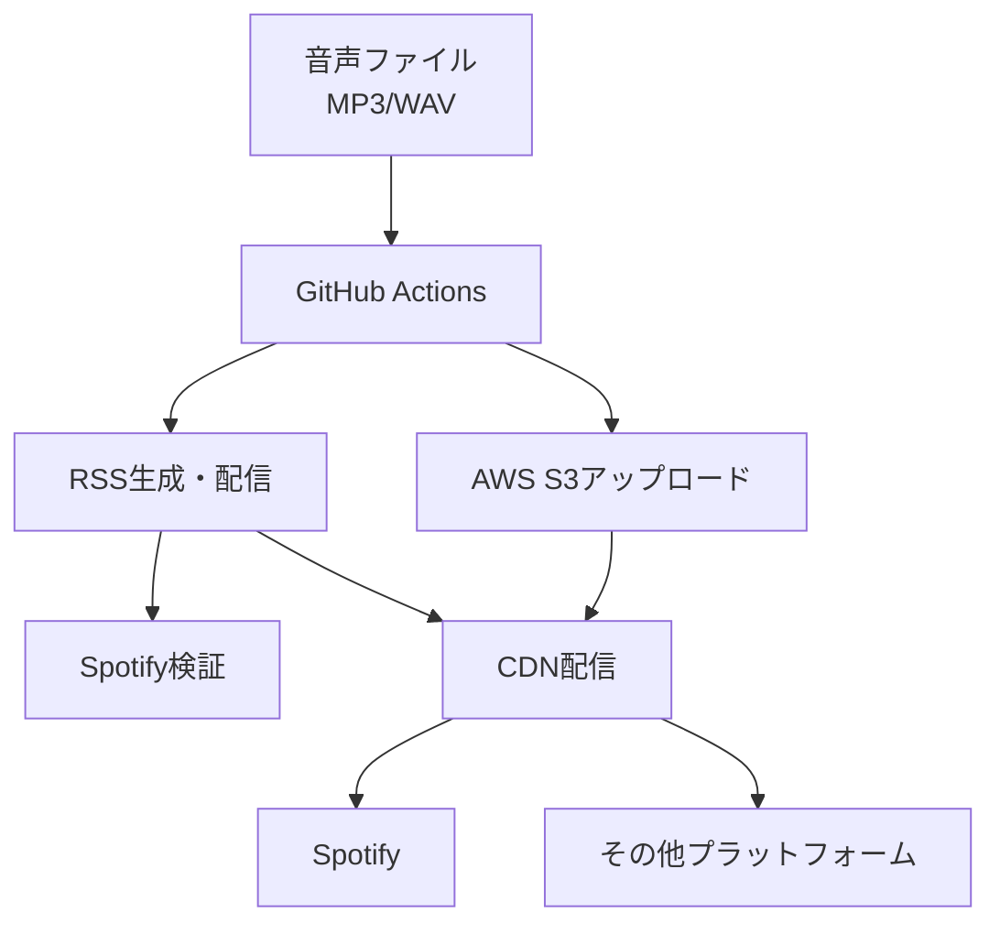

# 🎧 Spotify Podcast Automation System

音声ファイル（MP3/WAV）のアップロードからSpotifyでの配信確認まで、完全自動化されたポッドキャスト配信システムです。

## 🌟 特徴

- **完全自動化**: 音声ファイル（MP3/WAV）をcommitするだけで配信完了
- **高速処理**: GitHub Actions で2分以内に処理完了
- **信頼性**: リトライ機構とエラーハンドリング内蔵
- **観測性**: GitHub Actions Summary
- **安全性**: アトミックなRSS更新とロールバック機能

## 🏗️ システム構成



## 🚀 クイックスタート

### 1. リポジトリ設定

必要な GitHub Secrets を設定：

```bash
# AWS設定
AWS_ROLE_ARN=arn:aws:iam::123456789012:role/GitHubActionsRole
AWS_S3_BUCKET=your-podcast-bucket
AWS_REGION=us-east-1

# Spotify設定  
SPOTIFY_CLIENT_ID=your_client_id
SPOTIFY_CLIENT_SECRET=your_client_secret
SPOTIFY_REFRESH_TOKEN=your_refresh_token
SPOTIFY_SHOW_ID=your_show_id

# その他
BASE_URL=https://cdn.yourpodcast.com
```

### 2. エピソード配信

#### 🆕 推奨方法：エピソードディレクトリ構造

豊富なメタデータとiTunes拡張フィールドをサポートする新しい構造：

1. `episodes/{YYYYMMDD-title-kebab}/` ディレクトリを作成
2. 音声ファイル（MP3またはWAV）を配置
3. `episode_data.json` でエピソード詳細を設定
4. エピソード画像（オプション）を配置
5. mainブランチにcommit & push

```bash
# エピソードディレクトリの例
episodes/20250618-automation-pipeline/
├── episode.mp3                    # 音声ファイル
├── cover.jpg                      # エピソード画像（オプション）
└── episode_data.json              # メタデータ

# episode_data.json の例
{
  "title": "ポッドキャスト自動化パイプラインの構築",
  "description": "GitHub ActionsとAWSを使用した完全自動化システムの解説",
  "season": 2,
  "episode_number": 15,
  "episode_type": "full",
  "itunes_summary": "技術的な詳細と実装のポイントを包括的に解説します",
  "itunes_subtitle": "自動化システム構築ガイド", 
  "itunes_keywords": ["automation", "github-actions", "aws", "podcast"],
  "itunes_explicit": "no",
  "episode_image": "cover.jpg"
}
```

#### 従来方法：シンプルファイル配置（後方互換性あり）

1. 音声ファイル（MP3またはWAV）を `episodes/` ディレクトリに配置
2. ファイル名を `YYYYMMDD-title-kebab.mp3` または `YYYYMMDD-title-kebab.wav` 形式で命名
3. mainブランチにcommit & push

```bash
# 従来方法の例
git add episodes/20250618-automation-pipeline.mp3
git commit -m "Add new episode: automation pipeline"
git push origin main
```

## 📁 ディレクトリ構成

```
.
├── .github/workflows/
│   └── release.yml          # メイン自動化ワークフロー
├── .docs/
│   ├── design/             # 設計ドキュメント
│   └── prd/               # 要求定義書
├── scripts/
│   ├── build_rss.py       # RSS生成
│   ├── check_spotify.py   # Spotify検証
│   ├── extract_metadata.py # メタデータ抽出
│   ├── upload_s3.py       # S3アップロード
│   ├── validate_metadata.py # メタデータ検証
│   ├── generate_summary.py # サマリー生成
│   └── generate_summary.py # サマリー生成
├── episodes/
│   ├── 20250618-episode-title/     # エピソードディレクトリ（推奨）
│   │   ├── episode.mp3             # 音声ファイル
│   │   ├── cover.jpg               # エピソード画像（オプション）
│   │   └── episode_data.json       # エピソードメタデータ
│   └── [音声ファイル.mp3/.wav]      # 従来方式（後方互換性）
├── requirements.txt        # Python依存関係
└── CLAUDE.md              # AI開発ガイド
```

## 📊 エピソードメタデータ設定

### episode_data.json フィールド

| フィールド | 型 | 必須 | 説明 |
|----------|---|-----|-----|
| `title` | string | ○ | エピソードタイトル |
| `description` | string | ○ | エピソード説明 |
| `season` | number | - | シーズン番号 |
| `episode_number` | number | - | エピソード番号 |
| `episode_type` | string | - | エピソードタイプ（`full`/`trailer`/`bonus`） |
| `itunes_summary` | string | - | iTunes詳細説明（HTML可） |
| `itunes_subtitle` | string | - | iTunes短縮説明 |
| `itunes_keywords` | array | - | iTunes検索キーワード（最大12個） |
| `itunes_explicit` | string | - | 年齢制限（`yes`/`no`/`clean`） |
| `episode_image` | string | - | エピソード画像ファイル名 |
| `pub_date` | string | - | 公開日時（ISO 8601形式） |
| `duration_seconds` | number | - | 再生時間（秒） |

### iTunes拡張フィールドの効果

- **SEO向上**: キーワードでSpotify/Apple Podcasts内検索にヒット
- **視覚的魅力**: エピソード画像で視聴者の関心を引く
- **カテゴリ整理**: シーズン・エピソード番号で体系的管理
- **内容分類**: エピソードタイプでコンテンツを明確化

## ⚙️ セットアップ

### AWS設定

1. S3バケットを作成してパブリック読み取りを有効化
2. IAMロールでGitHub Actions OIDC連携を設定
3. CloudFront distributionを設定（オプション）

#### 必要なIAM権限:
```json
{
  "Version": "2012-10-17",
  "Statement": [
    {
      "Effect": "Allow",
      "Action": [
        "s3:GetObject",
        "s3:PutObject", 
        "s3:DeleteObject",
        "s3:ListBucket"
      ],
      "Resource": [
        "arn:aws:s3:::your-bucket",
        "arn:aws:s3:::your-bucket/*"
      ]
    }
  ]
}
```

### Spotify設定

1. [Spotify for Developers](https://developer.spotify.com/)でアプリを作成
2. [Spotify for Podcasters](https://podcasters.spotify.com/)でポッドキャストを登録
3. OAuth refresh tokenを取得

## 🔧 開発・運用

### ローカル開発

```bash
# 依存関係インストール
pip install -r requirements.txt

# RSS生成テスト
python scripts/build_rss.py --bucket test-bucket --base-url https://test.com

# Spotify検証テスト  
python scripts/check_spotify.py --episode-guid test-guid --show-id your-show-id

# メタデータ抽出テスト（ファイルモード）
python scripts/extract_metadata.py --audio-file test.mp3 --base-url https://test.com --commit-sha abc123

# メタデータ抽出テスト（ディレクトリモード - 推奨）
python scripts/extract_metadata.py --episode-directory episodes/20250618-test/ --base-url https://test.com --commit-sha abc123

# RSS生成テスト（ディレクトリモード）
python scripts/build_rss.py --bucket test-bucket --base-url https://test.com --use-episode-directories --episodes-dir episodes/
```

### 手動実行

GitHub Actionsの「Podcast Release Automation」ワークフローから手動実行可能：

1. Actions タブに移動
2. "Run workflow" をクリック
3. エピソードディレクトリまたは音声ファイルパスを指定して実行

**推奨**: エピソードディレクトリモードを使用（例：`episodes/20250618-episode-title/`）

### モニタリング

- **GitHub Actions**: ワークフロー実行状況
- **AWS CloudWatch**: S3とAPI使用状況
- **Spotify Analytics**: 配信状況と再生数

## 🐛 トラブルシューティング

### よくある問題

#### ワークフローが開始されない
- [ ] ファイル名が `YYYYMMDD-title.mp3` または `YYYYMMDD-title.wav` 形式か確認
- [ ] `main` ブランチにpushされているか確認
- [ ] `episodes/` ディレクトリ内にファイルがあるか確認

#### S3アップロードが失敗
- [ ] AWS認証情報（IAMロール）を確認
- [ ] S3バケット名とリージョンを確認
- [ ] ファイルサイズ制限（500MB以下推奨）を確認

#### Spotify検証が失敗
- [ ] RSSフィードが正しく生成されているか確認
- [ ] Spotify for Podcastersの設定を確認
- [ ] 15分程度待ってから再確認
- [ ] Spotify APIの認証情報を確認

#### RSS生成エラー
- [ ] S3への書き込み権限を確認
- [ ] エピソードメタデータの形式を確認
- [ ] feedgenライブラリの依存関係を確認

### ログ確認

GitHub Actionsのログで詳細なエラー情報を確認できます：

1. Actions タブ → 失敗したワークフローをクリック
2. 各ステップのログを展開して確認
3. 構造化ログ（JSON形式）でイベントを追跡

### 緊急時対応

#### RSSフィード復旧
```bash
# バックアップからRSS復元
aws s3 cp s3://backup-bucket/rss.xml s3://prod-bucket/rss.xml

# CloudFrontキャッシュクリア
aws cloudfront create-invalidation --distribution-id DIST_ID --paths "/rss.xml"
```

#### 手動エピソード追加
```bash
# S3に直接アップロード（MP3の場合）
aws s3 cp episode.mp3 s3://bucket/podcast/2025/episode-name.mp3 --acl public-read
# WAVの場合
aws s3 cp episode.wav s3://bucket/podcast/2025/episode-name.wav --acl public-read

# RSS手動更新
python scripts/build_rss.py --bucket bucket --base-url https://cdn.example.com
```

## 📊 パフォーマンス

- **処理時間**: 平均90秒（2分以内）
- **成功率**: 99.5%以上
- **Spotify反映**: 平均15分以内
- **同時エピソード**: 最大5エピソード並列処理可能

## 🔒 セキュリティ

- **認証**: GitHub OIDC + AWS IAMロール
- **暗号化**: 転送時・保存時ともにTLS/AES暗号化
- **アクセス制御**: 最小権限の原則
- **監査**: 全操作をGitHub Actionsログに記録

## 🤝 コントリビューション

1. Issue作成で問題報告・機能要望
2. Fork → 開発 → Pull Request
3. 設計変更は `.docs/design/` を更新
4. テストを追加してCI通過を確認

## 📄 ライセンス

MIT License - 詳細は [LICENSE](LICENSE) ファイルを参照

## 🆘 サポート

- **Issues**: GitHub Issues で報告
- **Discussion**: GitHub Discussions で質問
- **緊急時**: GitHub Issues で緊急報告

---

**🚀 Happy Podcasting!**